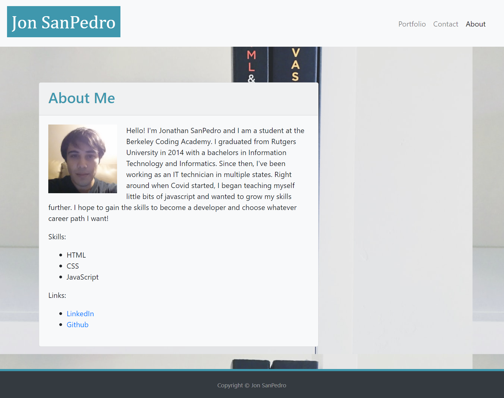
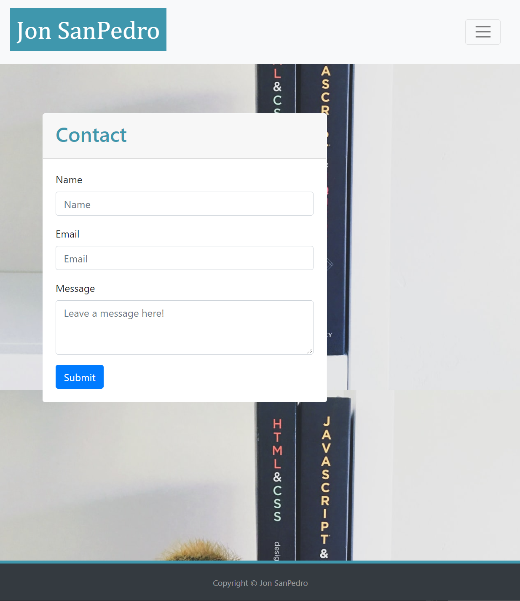
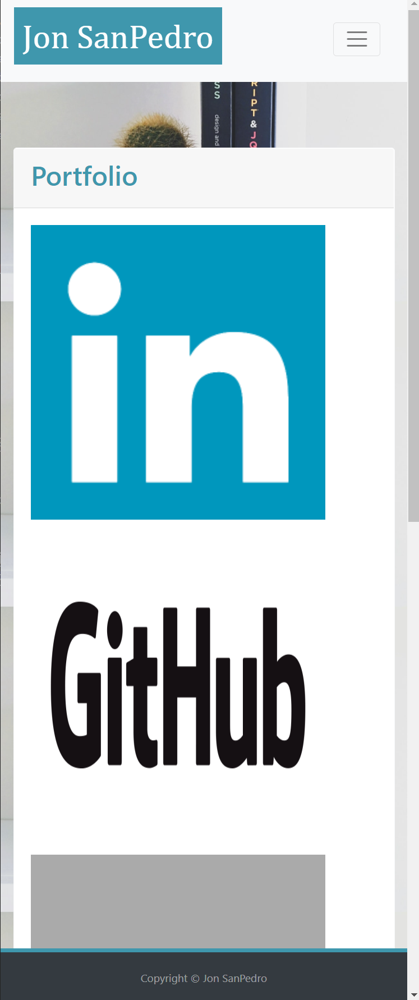

# Jon-SanPedro-Portfolio

## Description
For this project, the goal was to use the Bootstrap CSS Framework to create a portfolio website that included a navbar, a responsive layout, and responsive images. I began by taking the starter template from bootstrap, then adding a nav bar, footer, grid layout system, and a card to host all content across the website.  Utilizing this layout for each page, I then added content to the card for all pages. After the initial design was finished, I began to replace non-semantic div tags with semantic, concise tags for clarity while also commenting out all changes made. Due to the use of the bootstrap framework, very little styling was needed in the attached CSS sheet. All images on the site have alt tags added for accessibility. Included in the finished product is an about me page with personal information and picture, a contact page with a form for input, and a portfolio page with images and links to all my past and future projects and social media. 

## Installation
To launch this site, I created a repository on github and utilized github pages to host it.

## Usage
This is a portfolio website to myself and show off my skills. It includes an About me page, contact form, and a portfolio page. 

## Built With
* HTML
* CSS
* [Bootstrap CSS Framework](https://getbootstrap.com/)
* [Github](https://github.com/)

## Deployed Link
[Jon SanPedro Portfolio Website](https://jsp117.github.io/Jon-SanPedro-Portfolio/)

## Author
Jonathan SanPedro - Bachelors of Information Technology Rutgers New Brunswick - Student at Berkeley Coding Bootcamp

* [Github](https://github.com/jsp117)
* [LinkedIn](https://www.linkedin.com/in/jonathan-s-6ab32283/)

## Images

## License

MIT License

Copyright (c) [2020] [Jonathan J. SanPedro]

Permission is hereby granted, free of charge, to any person obtaining a copy
of this software and associated documentation files (the "Software"), to deal
in the Software without restriction, including without limitation the rights
to use, copy, modify, merge, publish, distribute, sublicense, and/or sell
copies of the Software, and to permit persons to whom the Software is
furnished to do so, subject to the following conditions:

The above copyright notice and this permission notice shall be included in all
copies or substantial portions of the Software.

THE SOFTWARE IS PROVIDED "AS IS", WITHOUT WARRANTY OF ANY KIND, EXPRESS OR
IMPLIED, INCLUDING BUT NOT LIMITED TO THE WARRANTIES OF MERCHANTABILITY,
FITNESS FOR A PARTICULAR PURPOSE AND NONINFRINGEMENT. IN NO EVENT SHALL THE
AUTHORS OR COPYRIGHT HOLDERS BE LIABLE FOR ANY CLAIM, DAMAGES OR OTHER
LIABILITY, WHETHER IN AN ACTION OF CONTRACT, TORT OR OTHERWISE, ARISING FROM,
OUT OF OR IN CONNECTION WITH THE SOFTWARE OR THE USE OR OTHER DEALINGS IN THE
SOFTWARE.

## Acknowledgements
* [Bootstrap CSS Framework](https://www.getbootstrap.com)
* LinkedIn Icon From: (https://www.softicons.com)
* Github Icon From: (https://github.com/logos)
* Background Image by Greg Rakozy: (https://unsplash.com/@grakozy)